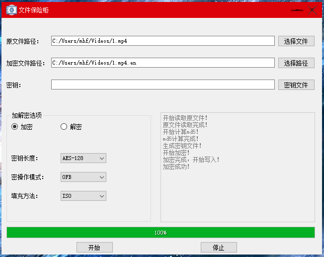
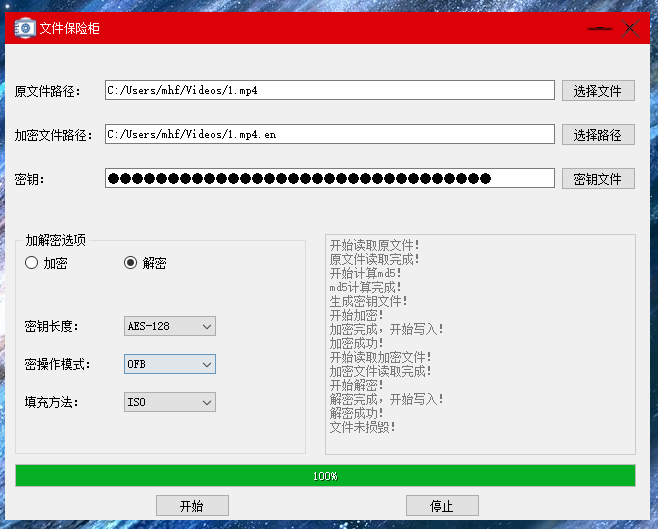

# 基于Qt开发的AES文件加解密工具:lock:

1. 支持所有 AES 密钥长度；:key:
   - AES_128
   - AES_192
   - AES_256 
2. 支持ECB、CBC、CFB、OFB四种模式；
3. 支持ZERO、PKCS7、ISO三种填充方式；
4. 支持md5文件损毁检测；:bookmark_tabs:
5. 每个文件加密可生成对应的密钥文件;

## 效果

1. 加密:computer:

   

2. 解密:computer:

   